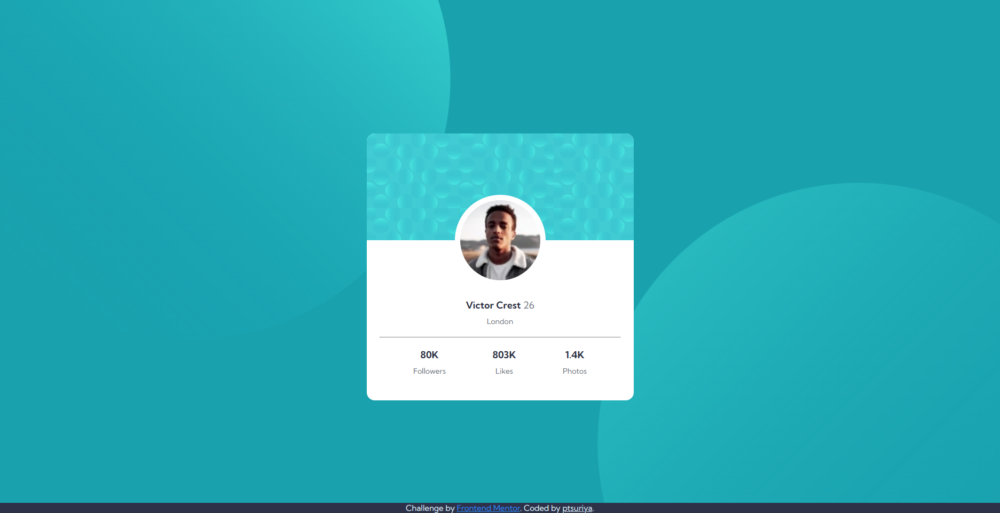

# Frontend Mentor - Profile card component solution

This is a solution to the [Profile card component challenge on Frontend Mentor](https://www.frontendmentor.io/challenges/profile-card-component-cfArpWshJ). Frontend Mentor challenges help you improve your coding skills by building realistic projects. 

## Table of contents

- [Overview](#overview)
  - [The challenge](#the-challenge)
  - [Screenshot](#screenshot)
  - [Links](#links)
- [My process](#my-process)
  - [Built with](#built-with)
  - [What I learned](#what-i-learned)
  - [Continued development](#continued-development)
- [Author](#author)

## Overview

### The challenge

- Build out the project to the designs provided


### Screenshot



### Links

- Solution URL: [Solution](https://ptsuriya.github.io/Frontend-Mentor_profile-card-component/)
- Live Site URL: [Live page](https://ptsuriya.github.io/Frontend-Mentor_profile-card-component/)

## My process

### Built with

- Semantic HTML5 markup
- CSS custom properties
- Flexbox

### What I learned

I review HTML , CSS alot inhere

example

how to manage BG image
```css
  background-image: url(./images/bg-pattern-top.svg),url(./images/bg-pattern-bottom.svg);
  background-position: -15% 150%,125% -150%;
  background-repeat: no-repeat, no-repeat;
```


### Continued development

I will make my own card 

- My own card: [not yet](notyet)


## Author

- Website - (not yet)
- Frontend Mentor - [@ptsuriya](https://www.frontendmentor.io/profile/ptsuriya)
- Twitter - [@Kuma_Midnight](https://twitter.com/Kuma_Midnight)
